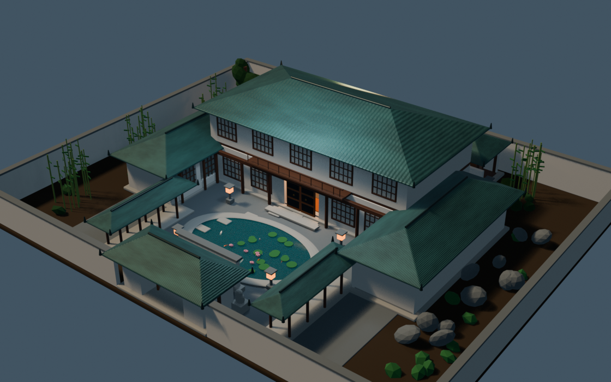
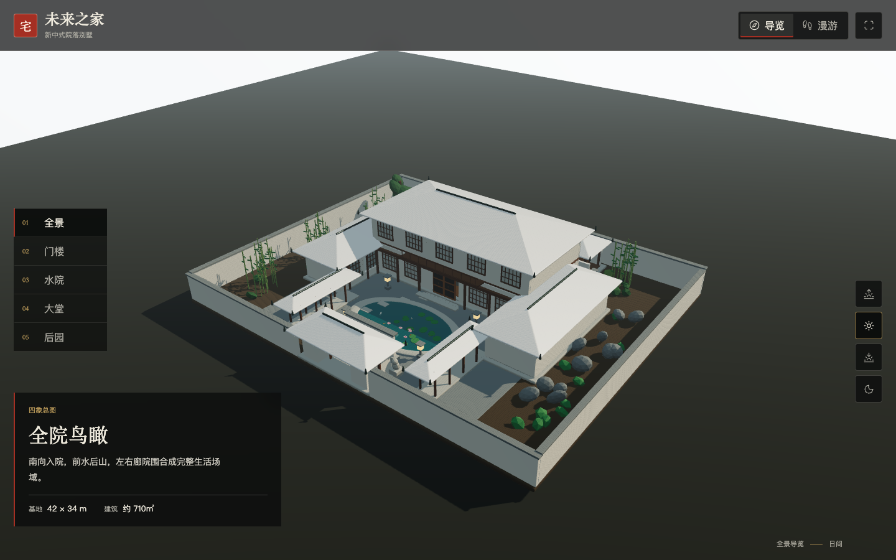
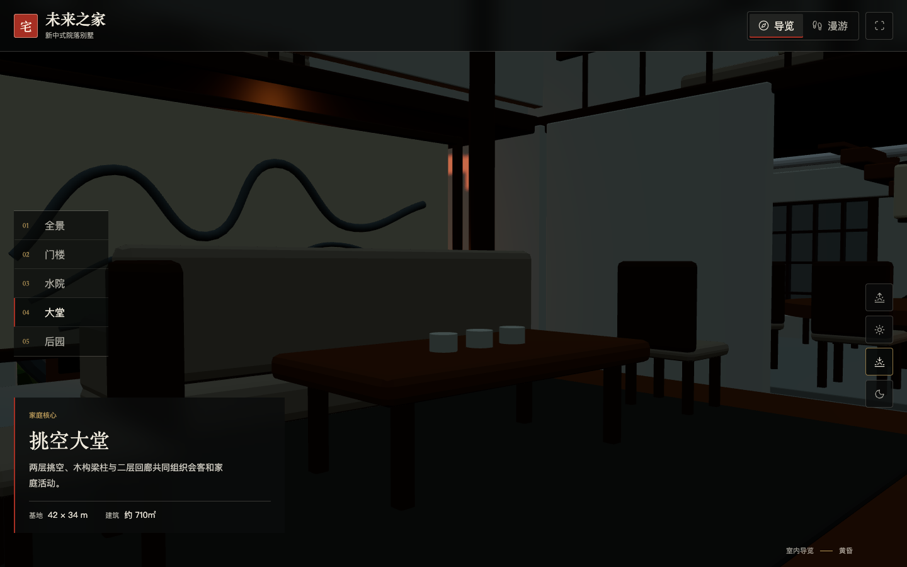
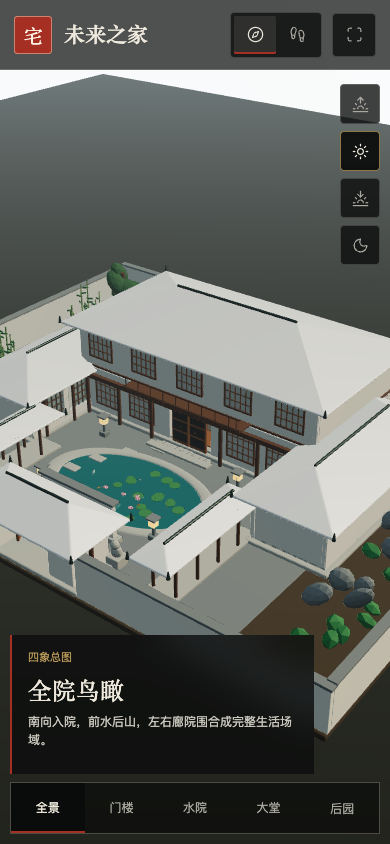
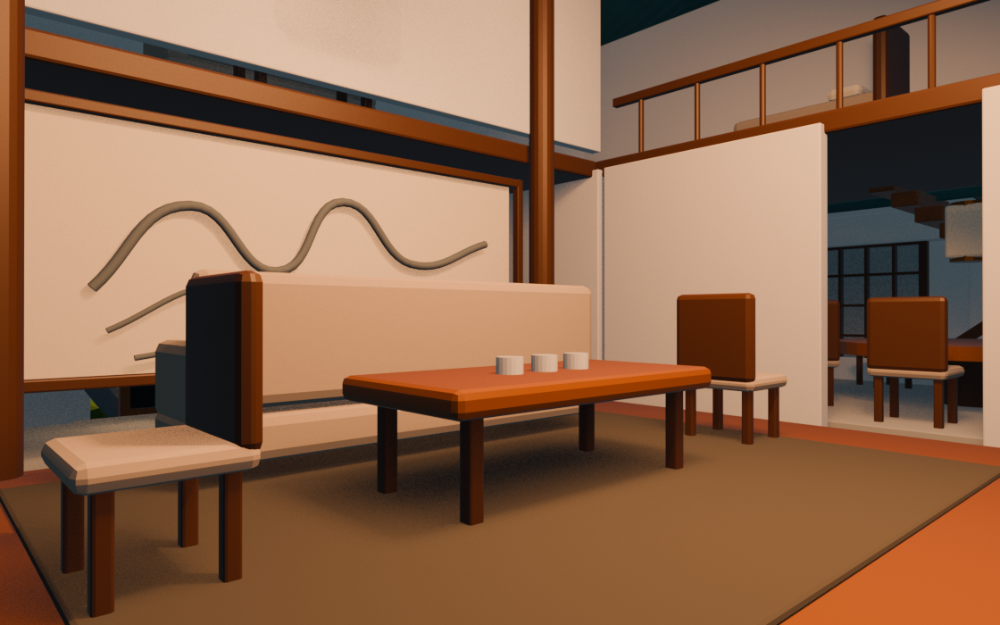
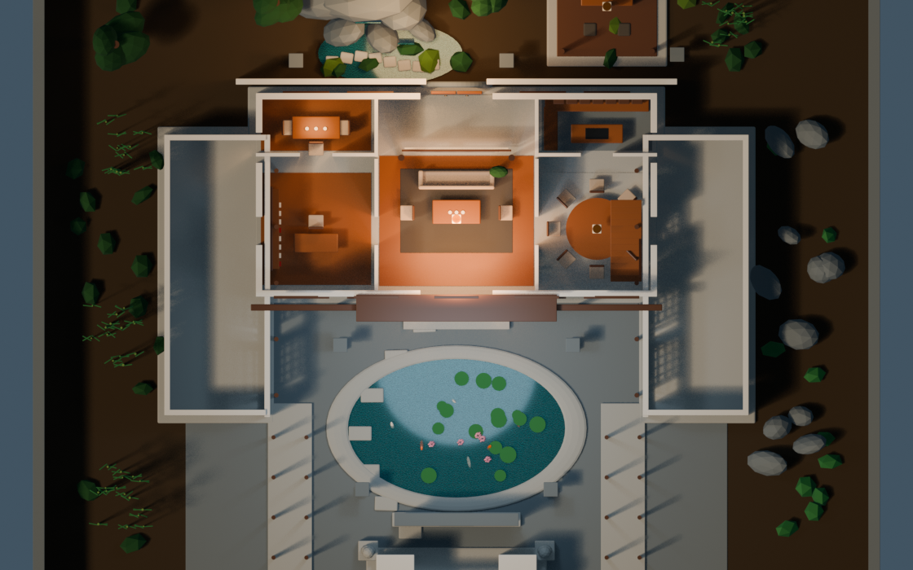

# Future Home Villa

一座位于 `42m × 34m` 基地上的完整新中式院落别墅概念模型。方案以南向门楼、
中轴礼序、前院聚水、左右围合和后院靠山为骨架，并补齐两层主楼、东西厢房、
连廊、室内家具和园林。



## 打开模型

- Blender 主文件：`assets/blender/future_home_villa.blend`
- 通用模型：`exports/future_home_villa.glb`
- Three.js 漫游器：`viewer/`
- 设计与尺寸：`docs/MODEL_SPEC.md`
- 原始文档：`docs/source_brief.md`
- 模型统计：`reports/model_manifest.json`

## 3D 漫游

```bash
cd viewer
pnpm install
pnpm dev
```

浏览器打开终端显示的本地地址。界面提供全景、门楼、水院、大堂与后园机位，
并支持自由漫游和清晨、日间、黄昏、夜景四套实时光照。

| 桌面全景 | 黄昏大堂 |
|---|---|
|  |  |

移动端界面：



## Blender 集合

- `00_Site`：基地和室外铺地
- `10_Architecture`：墙体、楼板、柱梁、门楼
- `11_Roofs`：主楼、厢房、连廊和亭子的屋顶
- `12_Doors_Windows`：格扇、门、影壁纹样和月洞门
- `20_Interior_Ground`：一层家具与陈设
- `21_Interior_Upper`：二层家具与回廊
- `30_Landscape`：水池、竹林、松柏、假山和叠水
- `40_Lighting`：太阳、环境补光和园灯
- `50_Cameras`：六个验收机位
- `90_Guides`：房间与关键空间标记

## 主要空间

一层包含大堂、书房、茶室、餐厅、中西厨、客房、后勤区和静心亭；二层包含
主卧套间、两间客卧和挑空家庭厅。室外包含门楼、影壁、荷池、东西连廊、
竹院、太湖石、月洞门和后院假山叠水。

## 说明

这是带完整空间关系、室内陈设和景观系统的建筑概念模型，可继续用于
Godot/Unity 漫游、材质深化或施工方案沟通；它不是结构计算、机电深化或
可直接施工的 BIM 文件。

## 效果展示

| 主楼大堂 | 首层平面 |
|---|---|
|  |  |
