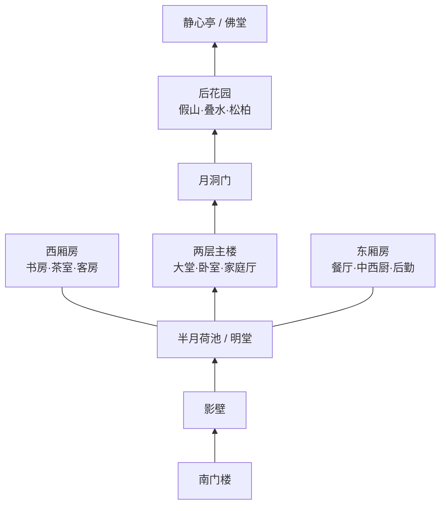

# 未来之家中式别墅建模规格

## 设计结论

整栋别墅采用“新中式居住功能 + 江南院落秩序”的组合，而不是复刻宫殿。
建筑以白墙、深胡桃木、青灰瓦、青石和暖色纸灯为主，重点表现真实可居住的
房间尺度、连续廊道、室内外视线和前后两重庭院。

## 坐标与规模

- 单位：米。
- `X`：东西向，东为正。
- `Y`：南北向，北为正。
- `Z`：竖直向上。
- 基地：`42m × 34m`，范围 `X=-21..21`、`Y=-17..17`。
- 建筑面积：约 `710㎡`。
- 层数：主楼两层，东西厢房、门楼和后园亭为一层。
- 建筑高度：首层 `3.6m`，二层 `3.3m`，主屋脊约 `9.8m`。

## 总图

## 建筑体块

| 模块 | 中心位置 | 尺寸 | 层数 |
|---|---:|---:|---:|
| 主楼 | `(0, 4.5)` | `20m × 10m` | 2 |
| 西厢房 | `(-12, 0.5)` | `5m × 14m` | 1 |
| 东厢房 | `(12, 0.5)` | `5m × 14m` | 1 |
| 南门楼 | `(0, -15)` | `8m × 3m` | 1 |
| 东西连廊 | `X=±8.5` | `2m × 15m` | 1 |
| 后园静心亭 | `(7.5, 13.5)` | `5m × 4m` | 1 |

## 一层房间

- 中央大堂 / 客厅：`8m × 9m`，局部挑空。
- 西侧书房：`5m × 4m`。
- 西北茶室：`5m × 4m`，面向竹院。
- 西厢客房套间：卧室、衣柜、独立卫浴。
- 东侧餐厅：`5m × 5m`，圆桌十人位。
- 东北厨房：中厨、西厨岛台、食品储藏。
- 东厢后勤：洗衣、设备、侧门和杂物储藏。
- 后侧佛堂 / 冥想室：`4m × 4m`。
- 主楼两侧布楼梯、客卫和玄关收纳。

## 二层房间

- 主卧套间：朝北看后花园，含卧室、衣帽间和双台盆内卫。
- 两间客卧：分别面向东、西侧院。
- 家庭厅：面向中庭挑空，连接二层回廊。
- 南向观景露台：俯瞰前院水景。

## 园林

- 南门内设照壁，入口动线绕壁进入，不直冲主厅。
- 前院设置约 `12m × 10m` 的开阔明堂，中央为浅水半月荷池。
- 西侧以竹林、连廊和较高绿量形成“青龙”。
- 东侧以低矮厢房、太湖石和修剪灌木形成“白虎”。
- 后院以假山、三级叠水、松柏和高院墙形成“玄武靠山”。
- 月洞门连接主楼后庭与静心亭。

## 交付物

- `assets/blender/future_home_villa.blend`：完整可编辑 Blender 工程。
- `exports/future_home_villa.glb`：可供 Godot、Unity 或 Web 预览的模型。
- `renders/01_aerial.png`：鸟瞰总图。
- `renders/02_entrance.png`：南门与前院。
- `renders/03_living_hall.png`：主楼大堂。
- `renders/04_back_garden.png`：后院假山与月洞门。
- `reports/model_manifest.json`：建筑、房间、景观和网格统计。
